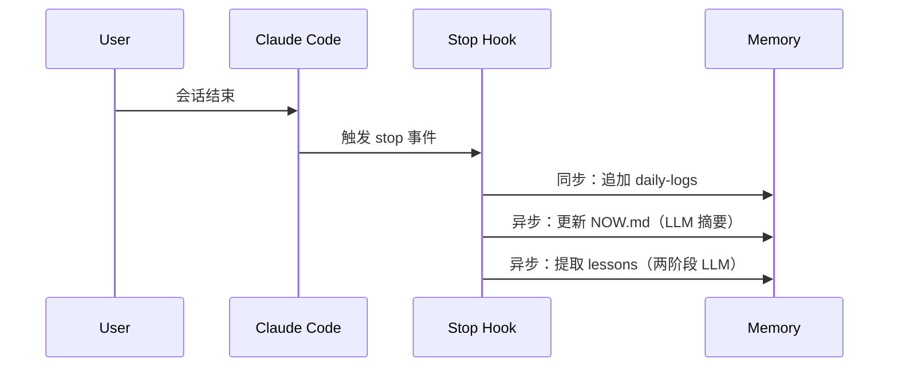

+++
date = '2026-04-07T10:00:00-05:00'
title = "给 Coding Agent 造一个记忆仓库"
summary = "每次会话结束，AI 的上下文清零——这不是 bug，是所有 coding agent 的根本缺陷。本文分享我如何用纯 Markdown 文件构建三层记忆架构，让 Claude Code 和 Codex 跨 session 记住决策和踩过的坑，哪些东西值得记、哪些是噪音，以及跨 agent 兼容时遇到的工程现实。"
categories = ["AI"]
tags = ["coding-agent", "memory", "Claude Code", "Codex", "developer-tools"]
+++

我被同一个问题坑了两次。

第一次：在一个 Next.js 项目里，我让 Claude Code 帮我配置 Tailwind v4 的 PostCSS 插件。它给了一个看起来正确的配置，build 一直报错。40 分钟后定位到原因——Tailwind v4 废弃了旧的 PostCSS 插件写法，必须用 `@tailwindcss/postcss`。问题解决，会话结束。

三周后，另一个项目，同样的问题。又是 40 分钟。

Claude Code 不记得它三周前帮我解决过这个问题。对它来说，每次会话都是第一次见面。

那一刻我决定：我要给它造一个记忆系统。

---

## 为什么记忆是刚需

重复踩坑是最直观的痛苦。但还有一种更隐性的消耗：**每次会话开头，你都在给 AI 补课。**

"这个项目用 pnpm，不是 npm。""API 鉴权用 JWT，token 在 `Authorization: Bearer` 里。""代码里 `legacy_` 前缀的函数不要动，那是给旧客户端留的。"

这些信息每次都要重新喂一遍，不然 AI 就会犯错。项目越大，"开场白"越长，token 和耐心都在燃烧。

纯靠 context window 能不能解决？能，但有天花板。对话历史越长，前期内容越容易被稀释（attention dilution），而且每次会话都要全量注入，成本线性增长。

我需要的是一套**主动管理的、分层的、持久化的**记忆系统。不是更大的 context window，而是一个让 agent 知道"哪些事情值得记住"的机制。

---

## 三层架构：精度与容量的平衡

记忆仓库放在 `~/memory/` 目录下，分三层：

```
~/memory/
├── daily-logs/          # 短期：完整会话日志（保留 14 天）
│   └── YYYY-MM-DD.md
├── reflections/         # 中期：蒸馏摘要（按项目分组）
│   └── my-blog.md
├── lessons/             # 长期：可复用的技术教训
│   └── frontend.md
└── NOW.md              # 当前工作状态快照
```

**为什么是三层，而不是一层？**

全量日志的问题：一次中等复杂度的会话，日志轻松超过 10,000 字。14 天的日志直接注入 context 不现实。

只保留摘要的问题：当 agent 需要核查某个具体的操作细节——比如"上次那个 Redis 配置改动的具体参数是什么"——摘要不够精确，你需要能回溯原始记录。

三层设计让你在不同情况下用不同粒度的记忆：

- 刚结束的会话？翻 `daily-logs`。
- 上个月某个项目的关键决策？看 `reflections`。
- 让 agent 永远记住某个教训？写进 `lessons`，打上 🔴 标记。

中期层的实现靠一个每日 cron job：读取当天 `daily-logs`，调 LLM 蒸馏成 400-500 字摘要，按项目分组追加到 `reflections/` 对应文件。不完美，但够用。

---

## NOW.md：接力棒，不是存档

三层记忆里，用得最频繁的不是日志，是 `NOW.md`。

```markdown
# 当前工作状态

**更新时间**: 2026-04-05 23:47

## 活跃项目

### my-blog
- **当前任务**: 重构评论系统，从 Cusdis 迁移回 Giscus
- **下一步**: 测试移动端 Giscus 主题切换
- **注意**: hreflang 标签已在上次会话中修复，不要再动

### coding-tools
- **当前任务**: 暂停，等 Fish Audio API 配额恢复
```

每次会话启动，第一件事读 `NOW.md`。这相当于给自己出门前留了一张便利贴："昨晚停在这里，明天从这里继续。"

没有它，每次会话开头都要花 3-5 分钟告诉 AI 你在做什么、做到哪里了。有了它，agent 30 秒内进入状态。

关键设计决策：`NOW.md` 只存**当前状态**，不存历史。它是接力棒，不是存档。历史交给 `daily-logs` 和 `reflections`。

---

## Hook 生态：让记忆写入自动化

手动维护记忆系统会失败。不是因为懒，而是你不会在每次会话结束时记得去更新文件——尤其是那些临时性的、"下次再说"的短会话。

我的解法是用 Claude Code 的 Stop hook 自动触发：



**同步 hook**（必须完成才退出）：

- `save_conversation_log.py`：把完整对话追加到当天的日志文件。这是最基础的一层，丢了什么都能从这里恢复。
- `update_docs_index.py`：重建 `docs/INDEX.md`，保证文档索引不漂移。

**异步 hook**（后台执行，不阻塞用户）：

- `update_now_md.py`：调 LLM 分析本次会话，更新 NOW.md 的工作状态。
- `extract_lessons.py`：两阶段提取——先判断本次会话是否有值得长期记录的教训，有的话再提取写入 `lessons/`。两阶段是为了省 token：大部分会话没有新教训，第一阶段快速判断就能跳过。

异步 hook 有一个关键细节：**冷却机制**。`update_now_md` 设置了 10 分钟的冷却期。短时间内连续结束多次会话，只有第一次触发 LLM 调用，之后的跳过。没有这个机制，频繁的短会话会让 API 账单飙升。

---

## 什么值得记，什么是噪音

这是整个系统最难的部分，也是我走弯路最多的地方。

**值得记的：**

- **反直觉的决策**：不是"我们用了 Redis"，而是"我们用 Redis 而不是 Memcached，因为需要持久化——纯缓存场景下 Memcached 更快"。理由比结论重要。
- **被坑了两次的教训**：那种"我以为我记住了，但还是又踩了"的问题，必须写进 `lessons`，加 🔴。
- **用户偏好和约定**：提交信息必须英文、代码注释必须英文、测试不删除——这些约定如果不记录，agent 每次都会按默认行为来。

**不值得记的：**

- **代码实现细节**：不要在记忆文件里写"函数 `processPayment` 接受三个参数"。直接读代码更准确，代码会变，记忆文件不会自动同步。
- **git 历史**：`git log` 比任何手写摘要都可靠。
- **临时任务状态**："今天下午 3 点和 PM 开会"——这种只在当前时间窗口有意义的信息，记进记忆文件是在制造噪音。

**最容易犯的错误：把记忆文件当真理。**

记忆会过期。路径会变，函数会重命名，依赖会升级。`lessons/frontend.md` 里写的"用 `@tailwindcss/postcss` 配 PostCSS"，Tailwind v5 出来之后可能又要变。正确的用法：agent 读到记忆里的信息，**先验证再引用**——把它当成一个可信的初始假设，而不是不可质疑的事实。

---

## 跨 Agent 兼容：工程现实

理想很美好，但不同 coding agent 有不同的 hook 系统，有些根本没有。

| Agent | Hook 机制 | 我的策略 |
|-------|-----------|----------|
| Claude Code | Stop hook（同步 + 异步）| 完整实现，最稳定 |
| Codex | SessionEnd 事件 | 用 `codex exec` 调用同样的脚本 |
| OpenCode | 无原生 hook | 手动 `/save` 命令触发 |

Codex 的集成有一个头疼的问题：`codex exec` 在非交互式环境下，OpenTelemetry 的初始化偶尔会失败，导致整个 hook 脚本无声地退出。花了两天才定位到——因为失败是无声的，日志里什么都没有。最终解法简单到让人想骂人：

```bash
export OTEL_SDK_DISABLED=true
```

LLM 后端也经历了一次迁移。最初用 Gemini CLI 做记忆蒸馏的 LLM 调用，但它在子进程里的行为不够稳定。后来换成了隔离的 Codex CLI 调用——每次都是冷启动，慢一些，但可靠性好很多。在自动化脚本里，可靠性永远排在速度前面。

指令文件方面，我把 `CLAUDE.md` 降级成了 `AGENTS.md` 的软链接——`AGENTS.md` 是真源，`CLAUDE.md` 只是 Claude Code 的兼容入口。维护一份规则文件让所有 agent 都能读到，比同步两份文件少掉很多漂移风险。

---

## 语音通知：不必要但让整个体验活过来

实用主义到这里就够了。但我还加了一个纯粹因为喜欢而加的东西：**语音通知**。

会话结束时，Fish Audio TTS 用一个固定的 AI 角色声音播报一句话会话总结。当 agent 触发权限请求时，也会有声音提示——你不会错过任何"它在问你要权限"的时刻。

技术上有一个细节：音频文件的生成用了原子写入（先写临时文件，再 rename），防止并发生成时文件损坏。

这功能占 hook 代码量的大约 30%，但提供的功能价值可能不到 5%。我不后悔。有时候工程不只是关于 ROI。当你的终端在深夜突然开口说话，告诉你"刚才帮你修好了 CSS 布局"，你会笑出来。这种愉悦感很难量化，但它让你愿意继续用这个系统。

---

## 这套系统适合谁

**适合：**
- 每天 3 次以上 coding agent 会话
- 同时维护多个项目，需要频繁切换上下文
- 有大量历史决策需要传承（尤其是跨月的长期项目）

**不适合：**
- 偶尔用一下 AI，每次任务相互独立
- 不想维护额外基础设施，宁愿每次重新解释

**我建议的最小化起点：只从 NOW.md 开始。**

一个文件，手动维护，每次会话前读一遍，结束后更新三行。不需要 hook，不需要 LLM 蒸馏，不需要三层架构。感受到价值之后，再按需加层。

过度设计记忆系统是真实存在的风险。我自己就走过这段弯路——有一阵子在记忆系统上花的时间，超过了用 AI 实际完成的工作。

记忆是手段，不是目的。当你的 agent 开始真正"记得"你时，你会知道它值得。
